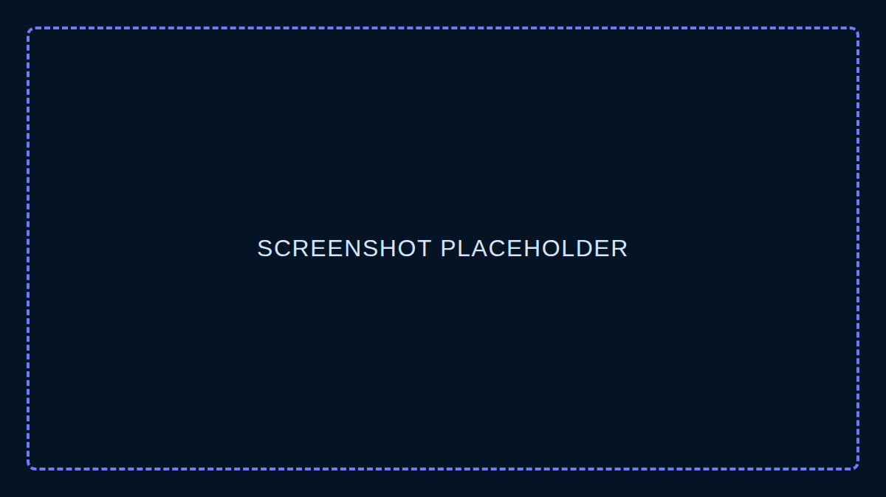

# Starmap

A star map for the game Waste of Space. Runs in the browser, search for planets and stars, click one to see its info.



## Live Site

https://dsetzer.github.io/starmap/

Deploys automatically from `main` via `.github/workflows/deploy.yml`.

## Works Offline (PWA)

It's a PWA. Open the site once, then use your browser's "Install app" / "Add to Home Screen" option. After that it works offline.

## Desktop App

`desktop/` wraps the web app in Electron.

```bash
cd desktop
npm install
npm start
```

To build a distributable:

```bash
npm run dist
```

## Running Locally

Install [Bun](https://bun.com/docs/installation), then:

```bash
git clone https://github.com/dsetzer/starmap.git
cd starmap/webui
bun install
bun run dev
```

### Hosting on your LAN

Find your local IP (e.g. `192.168.x.x`), then:

```bash
bun run dev -- --host
```

The app will be accessible from any device on your network at `http://<your-local-ip>:5173`.

## Credits

Forked from [someoneidoknow](https://github.com/someoneidoknow)'s Starmap.

- Textures by [dorpg](https://github.com/dorpg9)
- Search functions by [Zalander](https://github.com/anonymousomeone)
