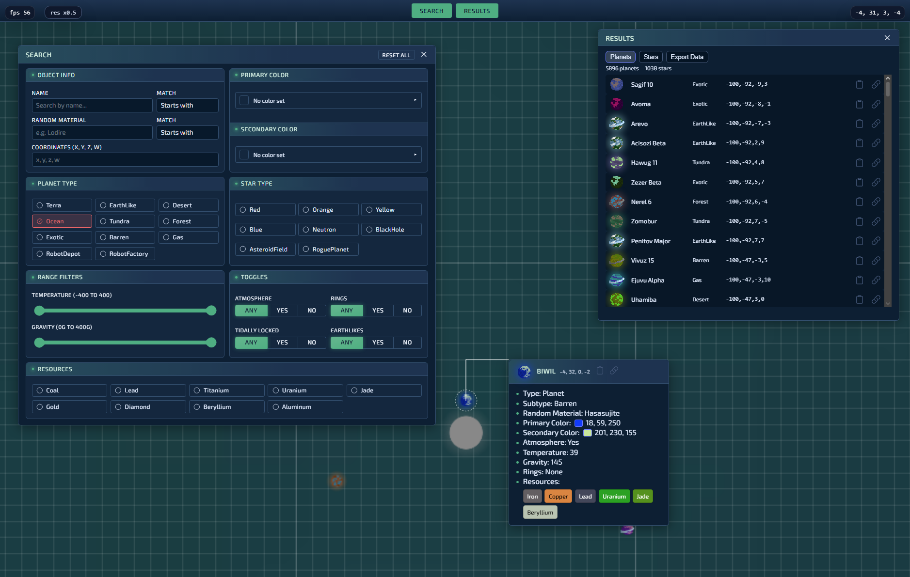

# Starmap

Browser-based star map for the Roblox game Waste of Space. Search for planets and stars, click one to see its info.



## Live Site

**https://dsetzer.github.io/starmap/**

The original Starmap needed Node.js installed and a local server running in the background before you could open the map. This one is just a web page on GitHub Pages. There's nothing to download and no server involved, not on your machine and not on mine. Once the page loads, the whole thing runs in your browser.

## Is anything I search logged?

No. Your searches never leave your device.

When the page loads, the entire universe database is downloaded into your browser. Every search, filter, and planet you click is handled right there on your own computer. None of it gets sent anywhere, because there is nowhere to send it. There's no backend, no database, and no analytics of any kind. Nobody can see what you look up.

## Save It As An App

Add it to your home screen or desktop and it opens from its own icon in its own window, with no internet needed.

- Chrome: install icon on the right side of the address bar, or menu > Cast, save and share > Install page as app
- Edge: menu > Apps > Install this site as an app
- Android: menu > Add to Home screen
- iPhone or iPad: Share button > Add to Home Screen
- Safari on Mac: File > Add to Dock

Opera and Firefox on computer don't offer this. A bookmark works just as well.

## Desktop App

`desktop/` wraps the web app in Electron.

```bash
cd desktop
npm install
npm start
```

To build a distributable:

```bash
npm run dist
```

## Running Locally

The live site is already available at https://dsetzer.github.io/starmap/, so you do not need to run anything locally just to use it. Local setup is only needed if you want to develop or run the project yourself.

Install [Bun](https://bun.com/docs/installation), then:

```bash
git clone https://github.com/dsetzer/starmap.git
cd starmap/webui
bun install
bun run dev
```

### Hosting on your LAN

Find your local IP (e.g. `192.168.x.x`), then:

```bash
bun run dev -- --host
```

The app will be accessible from any device on your network at `http://<your-local-ip>:5173`.

## Credits

- Original Starmap by [someoneidoknow](https://github.com/someoneidoknow)
- Textures by [dorpg](https://github.com/dorpg9)
- Search functions by [Zalander](https://github.com/anonymousomeone)
- Universe data by ArvidSilverlock
